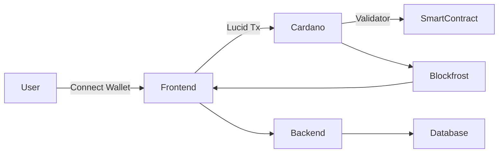
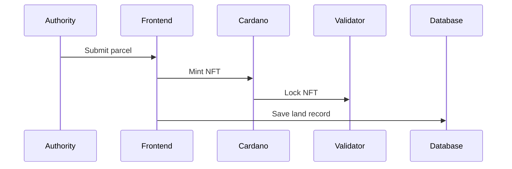
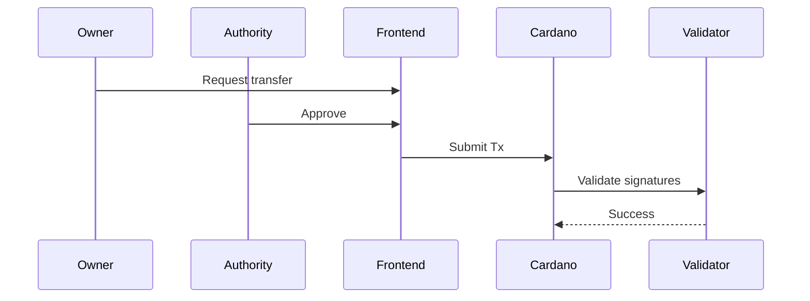
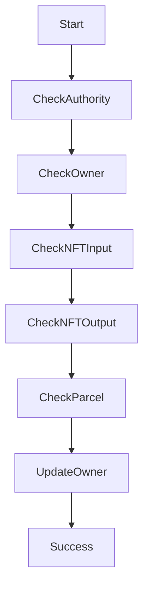

---

# 🏡 LandRegistry DApp

### Blockchain-Based Land Ownership & Transfer System (Cardano – Plutus V2)

Secure, immutable land registration and ownership transfer powered by **Cardano smart contracts**, **NFT-based land titles**, and a **PHP + MySQL backend**.

---

# 📚 Table of Contents

1. [Overview](#-overview)
2. [Key Features](#-key-features)
3.    [System Architecture](#-system-architecture)
4. [Smart Contracts](#-smart-contracts)
5. [Frontend](#-frontend)
6. [Backend](#-backend)
7. [Database Schema](#-database-schema)
8. [Wallet & Blockchain Flow](#-wallet--blockchain-flow)
9. [User Roles](#-user-roles)
10. [How the App Works (Step-by-Step)](#-how-the-app-works-step-by-step)
11. [Installation & Setup](#-installation--setup)
12. [Environment Configuration](#-environment-configuration)
13. [Security Design](#-security-design)
14. [Transaction Lifecycle](#-transaction-lifecycle)
15. [Architecture Diagrams](#-architecture-diagrams)
16. [Future Improvements](#-future-improvements)

17. ---

# 🌍 Overview

LandRegistry DApp is a decentralized land registration system that:

* Mints each land parcel as a **unique NFT**
* Locks ownership inside a **Plutus V2 validator**
* Requires **authority + owner signatures** for transfers
* Stores metadata and history in a backend database
* Allows wallet-based verification and tracking

Each land parcel becomes:

```
1 Parcel = 1 NFT = 1 Immutable Ownership Record
```

---

# 🚀 Key Features

### 🔐 Immutable Land Titles

Each parcel is minted as a unique NFT tied to a policy ID.

### 👮 Authority-Controlled Registration

Only the authority wallet can approve land registrations.

### 🔄 Secure Ownership Transfer

Transfers require:

* Current owner signature
* Authority signature
* NFT remains locked at validator
* Owner field updated in datum

* ### 📜 Full Transaction History

Users can search any wallet address and see:

* Registrations
* Transfers
* Status
* Transaction hashes

### 🖼 Land Document Storage

Documents stored on server (linked to parcel)

### 🌐 Wallet Integration

Built with:

* Lucid
* CIP-30 compatible wallets
* Blockfrost for chain indexing

---

# 🏗 System Architecture

This project uses a hybrid architecture:

* **On-chain:** Plutus V2 Smart Contracts
* **Off-chain:** Lucid (JavaScript)
* * **Frontend:** PHP + HTML + CSS
* **Backend:** PHP + MySQL
* **Blockchain:** Cardano Preprod

---

# ⛓ Smart Contracts

## 1️⃣ Land Minting Policy

* Mints NFT per parcel
* TokenName = SHA256(parcelId)
* Authority-signed minting

## 2️⃣ Land Registry Validator

Datum:

```haskell
data LandDatum = LandDatum
  { ldParcelId :: BuiltinByteString
  , ldOwnerPkh :: PubKeyHash
  }
```

Redeemer:

```haskell
data LandRedeemer
  = Transfer PubKeyHash
```

Validation rules:

* Authority must sign
* Current owner must sign
* NFT must remain locked
* Parcel ID must not change
* Owner must update correctly

---

# 💻 Frontend

Built with:

* PHP
* HTML5
* CSS3
* Lucid (JS module)
* Responsive dashboard UI

* Main Pages:

| Page          | Description         |
| ------------- | ------------------- |
| index.php     | Landing page        |
| login.php     | Authentication      |
| app.php       | Dashboard           |
| authority.php | Register land       |
| owner.php     | Transfer ownership  |
| assets.php    | View owned lands    |
| history.php   | Transaction history |

---

# 🗄 Backend

Backend stack:

* PHP (PDO)
* MySQL
* CSRF protection
* Authentication middleware
* JSON APIs

APIs include:

* `history_api.php`
* `register_land.php`
* `transfer_land.php`

 ---

# 🧮 Database Schema

## lands table

| Column            | Type     | Description     |
| ----------------- | -------- | --------------- |
| id                | INT      | Primary key     |
| parcel_id         | VARCHAR  | Unique parcel   |
| policy_id         | VARCHAR  | NFT policy      |
| token_name        | VARCHAR  | Hashed name     |
| initial_owner_pkh | VARCHAR  | First owner     |
| current_owner_pkh | VARCHAR  | Current owner   |
| created_at        | DATETIME | Timestamp       |
| tx_hash           | VARCHAR  | Registration tx |

---
# 👥 User Roles

### 🏢 Authority

* Registers land
* Signs transfers

### 👤 Land Owner

* Holds NFT
* Signs transfer requests

### 🔎 Public User

* View history

* * Verify ownership

---

# 🧭 How the App Works (Step-by-Step)

---

## 🏡 1. Register Land

1. Authority connects wallet
2. Upload land document
3. Enter parcel ID
4. Mint NFT
5. NFT locked at validator
6. Land stored in DB

   ---

## 🔄 2. Transfer Ownership

1. Current owner initiates transfer
2. Both owner & authority sign
3. Validator checks:

   * Authority signed
   * Owner signed
   * NFT preserved
   * Owner updated
4. Transfer recorded in DB

---

## 📜 3. View History

1. User enters wallet address
2. Address converted to PKH
3. Backend fetches:

   * Lands
   * Transfers
4. Displays:

   * Status
   * Tx Hash
   * Parcel ID

---

# ⚙ Installation & Setup

### Requirements

* PHP 8+
* MySQL
* Node.js (for Lucid)
* Cabal / GHC (for Plutus)
* Blockfrost API key

---

### 1️⃣ Clone Project

```
git clone <repo>
```

---

### 2️⃣ Configure Database

Edit:

```
config.php
```

Add:

```
DB_HOST
DB_NAME
DB_USER
DB_PASS
```

---

### 3️⃣ Compile Smart Contract

```
cabal build
cabal run
```

Outputs:

* land_validator.plutus
* land_validator.cbor

---

### 4️⃣ Configure Lucid

Edit:

```
BLOCKFROST_KEY
NETWORK
POLICY_ID
VALIDATOR_ADDRESS
```

---

### 5️⃣ Deploy to Hosting

Upload to:

* InfinityFree / VPS
* Or Localhost (XAMPP)

---

# 🔐 Security Design

✔ CSRF protection
✔ Signature verification
✔ NFT locked in validator
✔ Immutable parcelId
✔ Dual-signature transfer
✔ Authority enforcement

---

# 🔄 Transaction Lifecycle

```
Mint → Lock → Transfer → Update Datum → Record DB → View History
```

---

# 🧱 Architecture Diagrams

---

## 🔷 Overall Architecture



---

## 🔷 Registration Flow



---

## 🔷 Transfer Flow



---

## 🔷 Smart Contract Logic



---

# 🔮 Future Improvements

* IPFS document storage
* Multi-signature authority
* On-chain metadata registry
* Fractional ownership
* GIS map integration
* Mobile wallet support
* HTTPS SSL production deployment

---

# 📌 Important Notes

* Always use **HTTPS** in production.
* Never expose Blockfrost keys publicly.
* Always validate PKH length (56 hex).
* Always store tx_hash on registration.

---

# 🏁 Conclusion

LandRegistry DApp demonstrates:

* Real-world NFT use case
* Secure dual-signature validator
* Hybrid on-chain/off-chain architecture
* Production-style dashboard
* End-to-end Cardano integration

---
